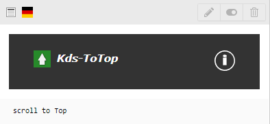

# KdsToTop
Die Extension KdsToTop stellt ein Content-Element zum nach oben scrollen auf der Seite dar.

## Installation
Sie können das Plugin über das TYPO3 TER installieren, oder hier herunterladen.

## Bilder
